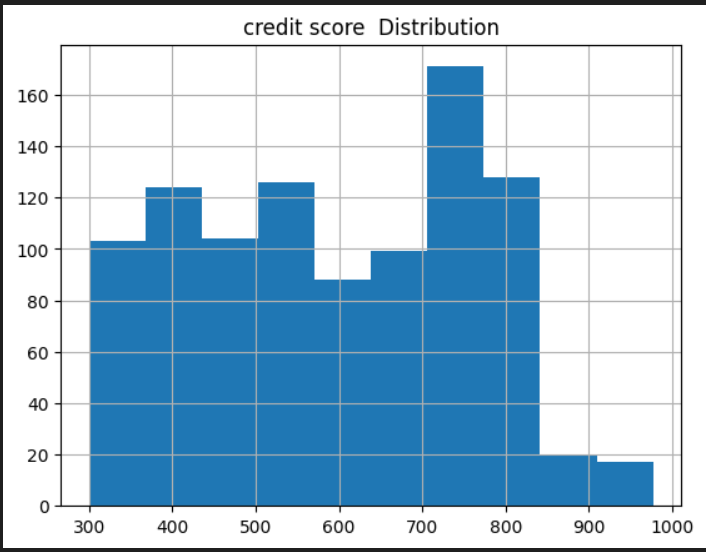
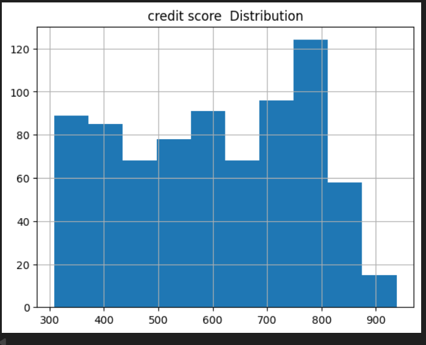

# 📊 Visual Analysis Gallery

This folder contains all **EDA and preprocessing visualizations** generated during the Holistic Data Preparer project.

---

## 1️⃣ Before Filling Missing Values

These plots show the data condition **before handling missing values**.

### Age (Before Filling)

### Income (Before Filling)

### Loan amount (Before Filling)

### creedit score (Before Filling)

---

## 2️⃣ Univariate Analysis

Univariate analysis helps understand **individual feature distributions**.

### Age Distribution

### Income Distribution

### loan amount Distribution

### credit score Distribution

---

## 3️⃣ Bivariate Analysis

Bivariate analysis shows **relationships between two variables**.

### Income vs Loan Amount

---

📌 **Note:**  
All visualizations are generated after proper data cleaning and preprocessing and are used to support feature engineering and modeling decisions.
